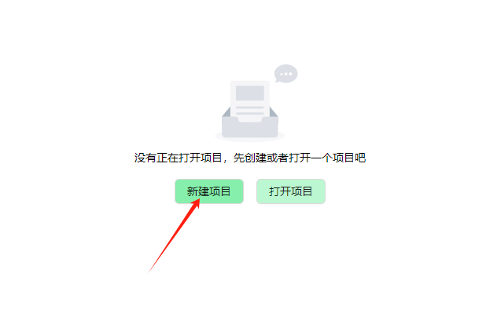
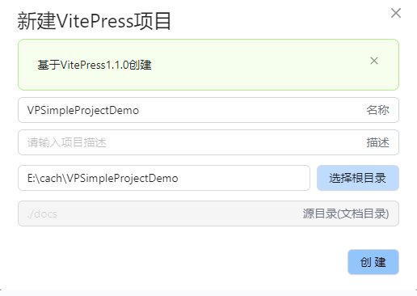
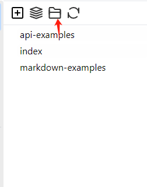

<div align="center">
<a href="https://github.com/zhangdi168/VitePressSimple">
</a>
</div>

[//]: # (<h1 align="center">VitePress Simple</h1>)

<h3 align="center">
<a target="_blank" href="https://vitepress.dev/">VitePress</a> Configuration Tool</h3>

<h3 align="center">
<strong>English</strong> |
<a href="https://github.com/zhangdi168/VitePressSimple/blob/master/README_ZH.md">
简体中文</a>
</h3>


[→→→ Quick Start Video Tutorial：](https://www.bilibili.com/video/BV1ki421y7uV/#reply219109211424)

# Features
* Developed based on wails2+vite+vue3+typescript
* Lightweight client program based on Webview2
* Online editor for markdown documents
* Support for document directory tree, including moving, cutting, copying, and pasting operations
* Support for directly copying and pasting images into markdown documents and automatically uploading them to the server
* Native configuration parsing, directly parsing and rendering .vitepress/config.mts
* Multilingual support, different languages can be configured separately
* Navigation bar can be visually configured, and different languages can be separately configured
* Sidebar can be visually configured, supporting multiple sidebar configurations, multiple languages, and automatic sidebar recognition
* Search configuration support, optional local configuration or third-party search services


# Quick Start Guide

Free download for Mac and Windows installation packages:
[GitHub download link](https://github.com/zhangdi168/VitePressSimple/releases)
| [Gitee download link](https://gitee.com/zhangdi168/VitePressSimple/releases)

View the complete document：[Chinese Documentation](http://vpsimple.xiaod.co/zh) |
[English Documentation](http://vpsimple.xiaod.co/en)


Below is an example VitePress project for easy exploration:
## Create VitePress project


Enter the project name and select the project root directory:


## online preview


After the creation is completed, you can **click the folder icon to enter the project root directory** 

```bash
# Go to the project root directory, not the original directory
npm install
npm run docs:dev
```
After executing the above command, VitePress can be tested to run. The default address is: http://localhost:5173. Modifying the document content or configuration in vpsimple will automatically update.


## Build the Project

### Runtime Environment Requirements

* Go (latest version)
* Node.js >= 16
* NPM >= 9

### Install Wails

```bash
go install github.com/wailsapp/wails/v2/cmd/wails@latest
```

### Clone the Repository

```bash
git clone https://github.com/zhangdi168/VitePressSimple --depth=1
```

### Build the Frontend Code

```bash
cd ./frontend
npm install 
```

### Compile and Run the Development Version

```bash
# preview
wails dev

# build
wails build
```

### About the Author
[Author's Personal Website: http://xiaod.co/](http://xiaod.co/)

Author's Wechat:bcxiaod

This project is completely free. If it has been helpful to you, you can buy the author a coffee ☕️.